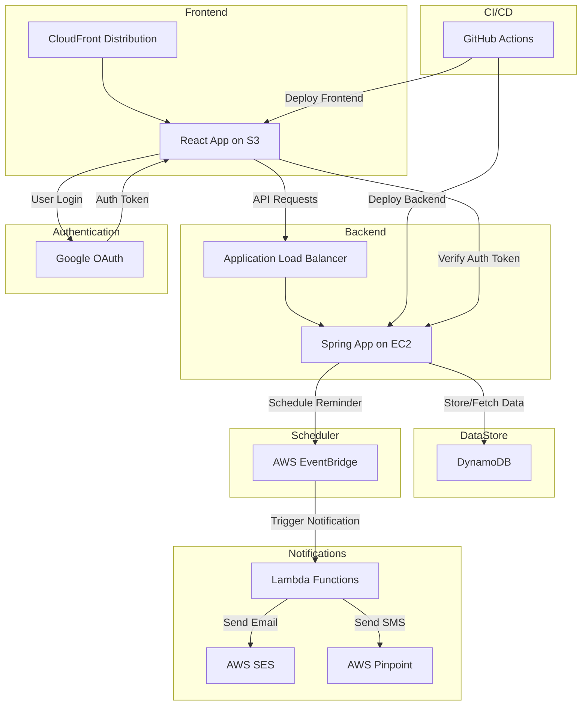

# [RemindMe](https://remindme.amsksolutions.com/)

RemindMe is a web application that allows users to schedule reminders with different contact methods (Email/SMS). The app features a robust, scalable backend built with Spring Boot and leverages several AWS services. It provides a seamless user experience with a React-based frontend hosted on AWS.

## Features

- Schedule reminders via Email or SMS.
- Manage and view all reminders.
- Time zone support for scheduling reminders.
- Google OAuth-based user authentication.

## Tech Stack

- **Frontend:** React, TypeScript, React Router, OAuth for authentication.
- **Backend:** Spring Boot, AWS SDK (DynamoDB, EventBridge, Lambda, Pinpoint, SES).
- **Deployment:**
  - **Frontend:** Hosted on AWS S3 and distributed via CloudFront.
  - **Backend:** Hosted on AWS EC2 behind an Elastic Load Balancer (ELB).

## Architecture Overview

The RemindMe app is a cloud-native application that integrates multiple AWS services to provide a scalable and efficient reminder scheduling system.

1. **Frontend:** A React application hosted on AWS S3 and served through CloudFront for fast, secure global delivery.
2. **Backend:** A Spring Boot application hosted on an AWS EC2 instance behind an Elastic Load Balancer (ELB) to handle incoming traffic.
3. **Database:** AWS DynamoDB is used for storing reminder data.
4. **Scheduling:** AWS EventBridge is used to schedule reminders.
5. **Notification Services:**
   - **Email Notifications:** Sent via AWS SES through Lambda functions triggered by EventBridge schedules.
   - **SMS Notifications:** Sent via AWS Pinpoint through Lambda functions triggered by EventBridge schedules.
6. **Authentication:** Google OAuth is used for user authentication.
7. **CI/CD:** Automated deployment using GitHub Actions for both the frontend and backend.

## Architecture Diagram

