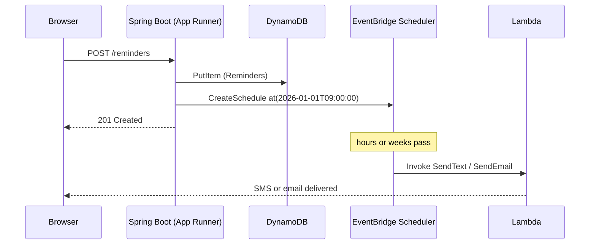
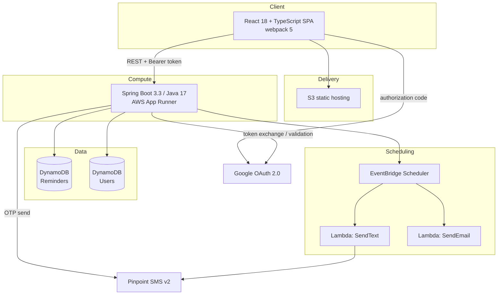

<div align="center">


**Simplify your day, one reminder away.**

[](https://github.com/Artin-Mirzayans/RemindMe/actions/workflows/react.yml)
[](https://github.com/Artin-Mirzayans/RemindMe/actions/workflows/spring.yml)

**[remindme.amsksolutions.com](https://remindme.amsksolutions.com)**

</div>

---

Sign in with Google, pick a date and time, write a short description, and RemindMe sends you
a text message or an email when it comes due. Phone numbers are verified with a one-time code
over AWS Pinpoint; email works without any setup.

## How reminders fire

There is no cron loop scanning for due reminders. Creating a reminder provisions a one-shot
EventBridge schedule at that exact timestamp, pointed at a delivery Lambda, so AWS does the
waiting and the API doesn't need to be running when a reminder comes due.


```mermaid
sequenceDiagram
    participant U as Browser
    participant API as Spring Boot (App Runner)
    participant DDB as DynamoDB
    participant EB as EventBridge Scheduler
    participant L as Lambda

    U->>API: POST /reminders
    API->>DDB: PutItem (Reminders)
    API->>EB: CreateSchedule at(2026-01-01T09:00:00)
    API-->>U: 201 Created

    Note over EB: hours or weeks pass

    EB->>L: Invoke SendText / SendEmail
    L-->>U: SMS or email delivered
```

## Architecture


```mermaid
graph TD
    subgraph Client
        R["React 18 + TypeScript SPA<br/>webpack 5"]
    end

    subgraph Delivery
        S3["S3 static hosting"]
    end

    subgraph Compute
        API["Spring Boot 3.3 / Java 17<br/>AWS App Runner"]
    end

    subgraph Data
        DR[("DynamoDB<br/>Reminders")]
        DU[("DynamoDB<br/>Users")]
    end

    subgraph Scheduling
        EB["EventBridge Scheduler"]
        LT["Lambda: SendText"]
        LE["Lambda: SendEmail"]
    end

    G["Google OAuth 2.0"]
    P["Pinpoint SMS v2"]

    R --> S3
    R -->|REST + Bearer token| API
    R -->|authorization code| G
    API -->|token exchange / validation| G
    API --> DR
    API --> DU
    API --> EB
    API -->|OTP send| P
    EB --> LT
    EB --> LE
    LT --> P
```

The `SendText` and `SendEmail` Lambdas are deployed separately and aren't in this repo.

## Stack

| Layer | Technology |
| --- | --- |
| Frontend | React 18, TypeScript, React Router 6, MUI X date pickers, webpack 5 |
| Backend | Spring Boot 3.3.2, Java 17, Maven |
| Storage | DynamoDB (`Reminders`, `Users`) |
| Scheduling | EventBridge Scheduler to Lambda |
| Messaging | AWS Pinpoint SMS v2 |
| Auth | Google OAuth 2.0, authorization-code flow |
| Hosting | S3 (client), AWS App Runner (API) |
| CI/CD | GitHub Actions |

## Data model

`Reminders` uses partition key `UserId` (the user's email) and sort key `DateTime` (UTC,
`YYYY-MM-DDTHH:MM:SSZ`). A `TTL` attribute expires past reminders, and queries filter on it so
elapsed reminders drop out of the list.

`Users` uses partition key `Email` and holds the phone number, current OTP, verification
status, and the request count and timestamp behind SMS rate limiting (10 requests max, 30s
cooldown).

## API

`/reminders`, `/users`, `/otp` and `/digest` sit behind a token filter and need an
`Authorization: Bearer <google-access-token>` header. The caller's email comes from the token
and is used as the partition key, so the client never supplies a user id.

| Method | Route | Purpose |
| --- | --- | --- |
| `GET` | `/` | Health check |
| `GET` | `/actuator/health` | Liveness / readiness probe |
| `POST` | `/oauth2callback?code=` | Exchange authorization code for tokens |
| `POST` | `/refresh-token?refresh_token=` | Mint a new access token |
| `GET` | `/reminders` | List the caller's upcoming reminders |
| `POST` | `/reminders` | Create a reminder |
| `DELETE` | `/reminders?contactMethod=&dateTime=` | Cancel a reminder |
| `GET` | `/users` | Caller's phone number and verification status |
| `GET` | `/digest` | Today's curated events digest |
| `POST` | `/otp/send?phoneNumber=` | Send a verification code |
| `POST` | `/otp/validate?otpCode=` | Confirm a verification code |

```json
{
  "dateTime": "2026-01-01T09:00:00Z",
  "contactMethod": "Text",
  "description": "call mum"
}
```

`description` is 3-20 characters, `dateTime` must be UTC and in the future, and
`contactMethod` is `Text` or `Email`, all enforced by bean validation on the model and
returned as a field-keyed 400 by the global exception handler.

## Running locally

Needs Node 20, JDK 17, Maven, and AWS credentials on the default provider chain with access to
the DynamoDB tables, EventBridge schedule groups, and Pinpoint.

```bash
cd server
OAUTH_CLIENT_SECRET=<google-oauth-client-secret> mvn spring-boot:run
```

```bash
cd client
npm install
npm start
```

The API comes up on `:8080` and the client on `:3000`. `SERVER_API_URL` and
`OAUTH_REDIRECT_URI` are read from `.env.development` (or `.env.production` for a production
build) through `dotenv-webpack`.

```bash
cd client && npm run lint && npm run typeCheck && npm test && npm run build
cd server && mvn test
```

## Deployment

Both pipelines run on push to `master` and can be triggered manually.

`react.yml` installs, lints, type-checks, builds, then runs `aws s3 sync client/dist` against
the hosting bucket with `--delete`.

`spring.yml` builds and tests with Maven, then builds `server/Dockerfile`, pushes it to ECR,
and App Runner auto-deploys the new `:latest` image. See `server/deploy/apprunner-migration.md`
for the one-time setup.

The API is one always-on AWS App Runner service (0.5 vCPU / 1 GB) in `us-west-2` - App Runner
handles TLS, the custom domain, health checks, and rolling deploys. It authenticates to AWS
with an **instance role** (`server/deploy/apprunner-instance-policy.json`), no access keys.
DynamoDB, EventBridge Scheduler, and Pinpoint stay in `us-west-1` (adjacent region, ~15-20 ms
away). App Runner has no local disk, so the generated feeds persist to a `FeedCache` DynamoDB
table instead of a file.

### Architecture decision: EC2 + ALB → AWS App Runner (2026-09)

The API started on EC2 behind an Application Load Balancer, both chosen as learning exercises.
Once it was running the economics didn't hold up: ~$40/mo for a hobby app, ~$18 of it the ALB
fronting a single instance that never autoscaled, plus an always-on JVM for a workload that is
overwhelmingly cached reads.

Priced the alternatives. **ECS/Fargate** came out at ~$36-40/mo - Fargate compute (~$18) plus
an ALB (~$18) that's the exact cost being removed, so it saves nothing. **App Runner** is the
managed layer on top of Fargate: it bundles the load balancer, TLS, and scaling, bills memory
24/7 but vCPU only while serving requests, and lands at ~$6/mo for this traffic. Went with App
Runner and kept the Spring codebase as-is - the framework was never the cost, the always-on
footprint vs. traffic was.

**Revisit if** sustained traffic climbs enough that always-on memory billing loses to true
scale-to-zero (Lambda), or if multi-region or finer network control is needed - at which point
ECS/Fargate with an ALB becomes worth its price.

## Layout

```
client/
  src/
    styles/          design tokens, base layer, shared component classes
    components/
      Auth/          OAuth flow, axios client with refresh interceptor, route guard
      Navbar/        responsive desktop / mobile navigation
      Reminder/      list, cards, and the create-reminder modal
      Profile/       phone number entry and OTP verification
      Digest/        today's curated events page
    pages/           login, main shell, 404
server/
  src/main/java/com/
    remindme/
      controllers/   REST endpoints
      services/      reminder, OTP, and EventBridge scheduling logic
      repositories/  DynamoDB access
      filters/       bearer token validation
      config/        AWS clients, CORS, filter registration
      digest/        daily events digest: Claude generator, cache, endpoint
    exception/       validation annotations and global handler
    target/          EventBridge Lambda target factory
```

## Daily digest

`GET /digest` returns a short list of notable things happening today, generated by Claude with
the web search tool and used to seed reminders straight from the Today page.

The digest is generated **once per day for everybody**, not per user: `DigestService` holds the
day's result behind a lock, so concurrent first-requests collapse into a single model call.
Failures and empty results are deliberately not cached, so a bad run retries rather than
blanking the page until midnight.

Set `ANTHROPIC_API_KEY` to enable it. Without the key the app still runs and `/digest` returns
an empty list, so the feature is optional rather than a hard dependency.

## Testing

```bash
cd server && mvn test      # 41 tests
cd client && npm test      # unit tests, jsdom
```

Server coverage is heaviest around the parts that can silently lose a reminder: the
store/schedule rollback paths in `ReminderService`, schedule-name round-tripping in
`EventBridgeScheduler`, and request validation in `ReminderController`.

## Styling

Colour, spacing, radius, shadow and typography values are custom properties in
[`tokens.css`](client/src/styles/tokens.css), with shared `.btn` and `.input` primitives in
[`components.css`](client/src/styles/components.css). Component stylesheets reference tokens
instead of literals.

Everything is sized in `rem` and scales off a single fluid root font-size,
`clamp(9px, 6.4px + 0.68vw, 16px)`, which keeps width media queries to a minimum.

## Known gaps

- Tokens are validated against Google on every request, which puts a network round trip in
  front of each authenticated call. Verifying an ID token locally against cached JWKS would
  remove it.
- The Google refresh token is held in `localStorage`, so any XSS would expose long-lived
  account access.
- OTP codes are generated with `Math.random()` and never expire; they should use
  `SecureRandom` with a TTL.
- Lambda ARNs and the AWS account id are hardcoded in `TargetFactory` rather than configured.
- The bundle isn't code-split (~723 KiB, mostly MUI) and `bundle.js` has no content hash, so
  a deploy can serve stale JavaScript to cached clients.
- The delivery Lambdas live outside this repo, so the system can't be stood up from here
  alone.
- The digest is cached on one instance (in memory, with a copy in the FeedCache DynamoDB table). Fine for a single instance but would
  need to move to DynamoDB (partition key on the date) behind a load balancer.

## Roadmap

Extend RemindMe past user-created reminders into a daily curated digest of notable events,
generated once per day and surfaced as both an in-app dashboard and an optional push. The
verified-contact and delivery pieces already exist, which is what makes it cheap to add.
