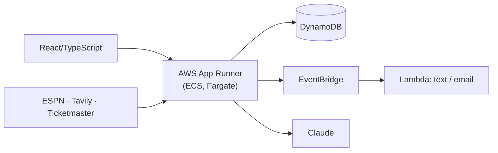

**Simplify your day, one reminder away.**

**[remindme.amsksolutions.com](https://remindme.amsksolutions.com)**

## What it is

RemindMe is a reminder app that texts or emails you at the exact time you pick, paired with three
AI-curated feeds that find the things worth setting a reminder for:

- **Today & Tomorrow** - the games, premieres, fights and finals you can watch live in the next two days
- **Planning Ahead** - the biggest events over the next two weeks, re-sorted toward what you tend to click
- **Nearby** - concerts, games and shows worth leaving the house for in your area

Today & Tomorrow and Nearby are open to everyone. Signing in with Google unlocks reminders and
the personalized Planning Ahead.

It runs on managed, serverless AWS services, so it's cheap to run and scales with demand.
Reminders are scheduled with EventBridge and sent by Lambda at the exact moment they're due, and
the AI feeds are generated once, cached and shared, so they stay fast and inexpensive however many
people use them. Logging and metrics track reliability and performance across every feature.

## Preview

<table>
  <tr>
    <td width="50%" valign="top">
      <b>Today &amp; Tomorrow</b> 
      
    </td>
    <td width="50%" valign="top">
      <b>Nearby (Los Angeles)</b> 
      
    </td>
  </tr>
  <tr>
    <td width="50%" valign="top">
      <b>Planning Ahead</b> 
      
    </td>
    <td width="50%" valign="top">
      <b>AI Health</b> 
      
    </td>
  </tr>
</table>

Today &amp; Tomorrow is shown with sample data on a busy sports weekend; the other screens are live.

## Why I built it

Most reminder apps assume you already know what you want to be reminded of. The more common
problem is the opposite: you miss the fight or the finale because you never knew it was
happening. RemindMe puts the discovery and the reminder in one place - see something worth
watching, tap "Remind me", and it's handled.

## Architecture

```mermaid
graph LR
    U["React/TypeScript"] --> API["AWS App Runner<br/>(ECS, Fargate)"]
    API --> DB[("DynamoDB")]
    API --> EB["EventBridge"]
    EB --> L["Lambda: text / email"]
    API --> C["Claude"]
    D["ESPN · Tavily · Ticketmaster"] --> API
```

## Stack

- **Frontend:** React, TypeScript
- **Backend:** Java, Spring Boot
- **AWS:** App Runner, DynamoDB, EventBridge, Lambda, S3 + CloudFront, Pinpoint (SMS)
- **AI and data:** Claude API, Tavily, ESPN, Ticketmaster
- **Auth and delivery:** Google OAuth, GitHub Actions CI/CD
