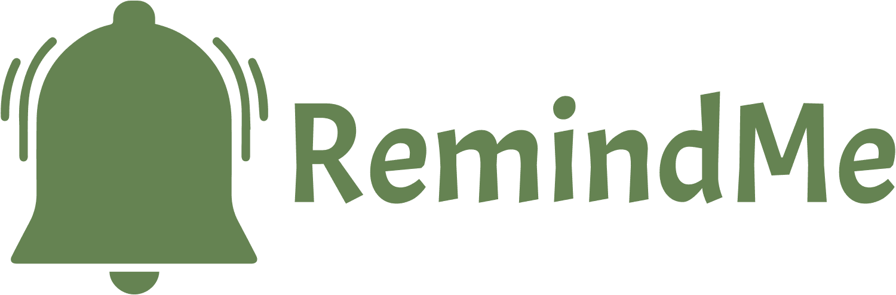
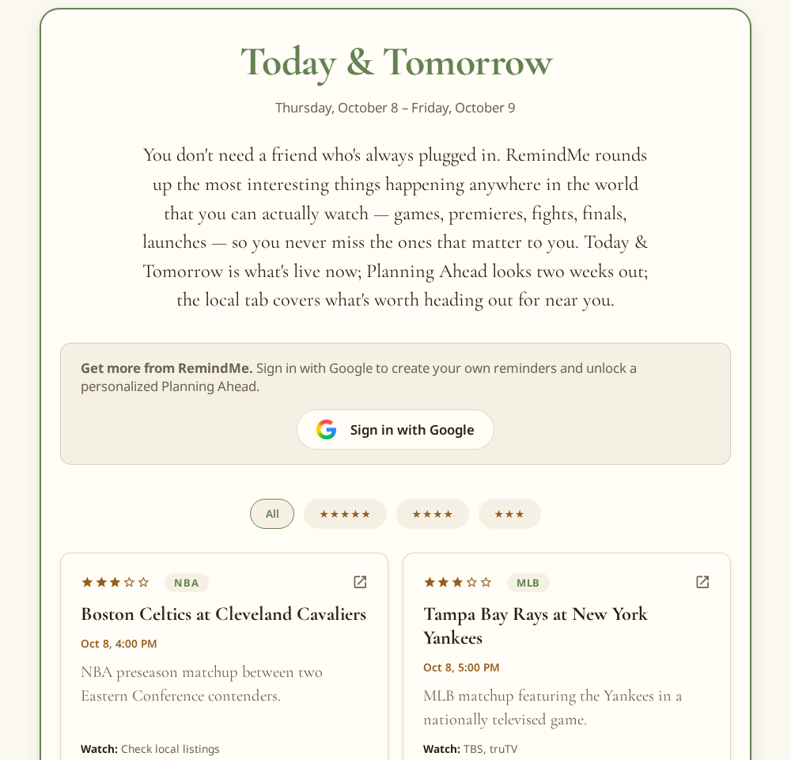
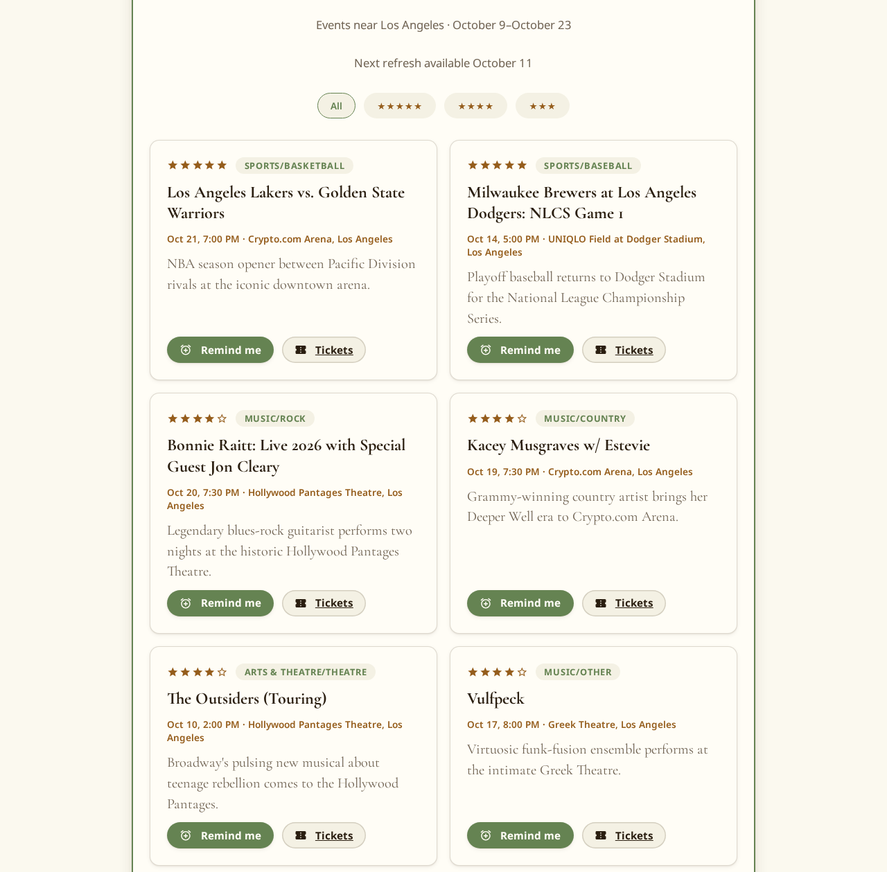
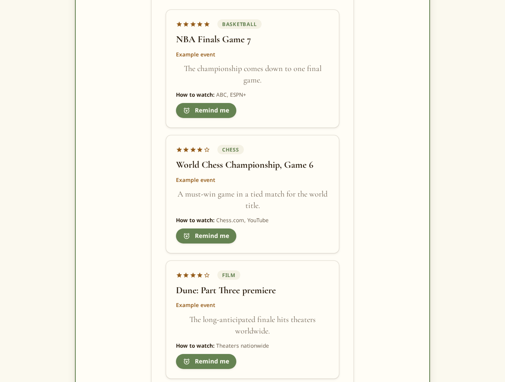
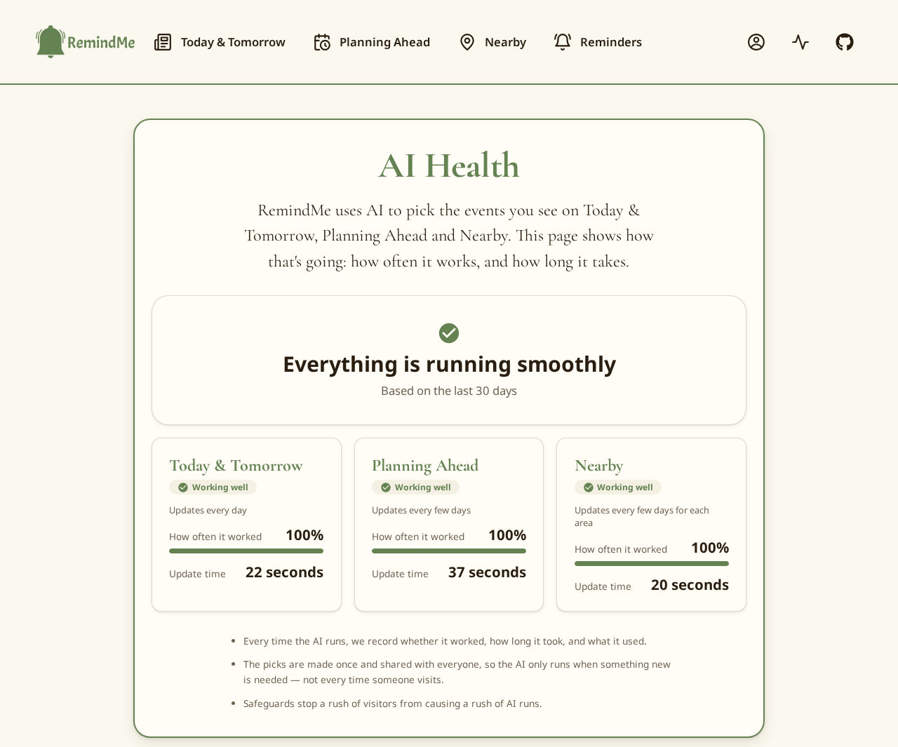
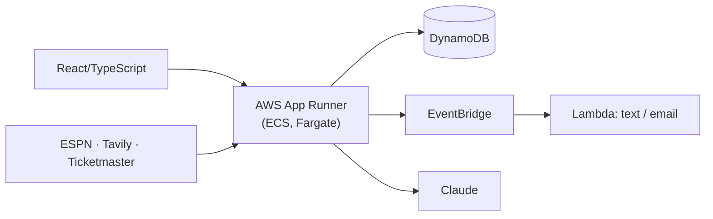

**Simplify your day, one reminder away.**

**[remindme.amsksolutions.com](https://remindme.amsksolutions.com)**

## What it is

RemindMe is a reminder app that texts or emails you at the exact time you pick. Alongside it are
three lists that find the things worth setting a reminder for:

- **Today & Tomorrow** - the games, premieres, fights and finals you can watch live over the next two days
- **Planning Ahead** - the biggest things coming up over the next two weeks, sorted toward what you tend to click
- **Nearby** - concerts, games and shows worth leaving the house for in your area

Today & Tomorrow and Nearby are open to everyone. Signing in with Google lets you set reminders
(once, or repeating), edit them, add them to your calendar, and unlocks the personalized
Planning Ahead.

## Preview

<table>
  <tr>
    <td width="50%" valign="top">
      <b>Today &amp; Tomorrow</b> 
      
    </td>
    <td width="50%" valign="top">
      <b>Nearby (Los Angeles)</b> 
      
    </td>
  </tr>
  <tr>
    <td width="50%" valign="top">
      <b>Planning Ahead</b> 
      
    </td>
    <td width="50%" valign="top">
      <b>AI Health</b> 
      
    </td>
  </tr>
</table>

Today &amp; Tomorrow is shown with sample data on a busy sports weekend; the other screens are live.

## Why I built it

Most reminder apps assume you already know what you want to be reminded of. The more common
problem is the opposite: you miss the fight or the finale because you never knew it was
happening. RemindMe puts the discovery and the reminder in one place - see something worth
watching, tap "Remind me", and it's handled.

I also wanted it to be a real, finished product rather than a demo: something that is live,
keeps running without constant attention, stays cheap, and could grow without being rebuilt.

## How it's built, and why

- **Reminders go off on their own.** Setting a reminder tells AWS to wake up at that exact
  moment and send the message. Nothing has to sit there watching the clock, so it's reliable and
  costs almost nothing while it waits.
- **The lists are made once and shared.** Picking what's worth watching takes an AI a little while
  and costs money each time. So each list is built once, saved, and shown to everyone until it's
  time for a fresh one. That keeps pages fast and costs small, however many people visit.
- **Real facts first, AI second.** Schedules, matchups and ticket listings come from sources
  like ESPN and Ticketmaster, plus web searches for things like TV and film, so the times and
  names are real. The AI only chooses what's worth your attention and writes the short descriptions.
- **Look around before signing in.** You can browse the lists without an account. Signing in is
  only needed for things that are personal, like reminders.
- **It keeps an eye on itself.** Every time the AI runs, the app records whether it worked and
  how long it took. A public [AI Health](https://remindme.amsksolutions.com/ai-health) page shows
  how that's going.
- **Hosted on services AWS runs.** There's no server to look after by hand, and a code change
  goes live automatically after it passes its checks.

## Architecture

```mermaid
graph LR
    U["React/TypeScript"] --> API["AWS App Runner<br/>(ECS, Fargate)"]
    API --> DB[("DynamoDB")]
    API --> EB["EventBridge"]
    EB --> L["Lambda: text / email"]
    API --> C["Claude"]
    D["ESPN · Tavily · Ticketmaster"] --> API
```

## Stack

- **Frontend:** React, TypeScript
- **Backend:** Java, Spring Boot
- **AWS:** App Runner, DynamoDB, EventBridge, Lambda, S3 + CloudFront, Pinpoint (SMS)
- **AI and data:** Claude API, Tavily, ESPN, Ticketmaster
- **Auth and delivery:** Google OAuth, GitHub Actions CI/CD
